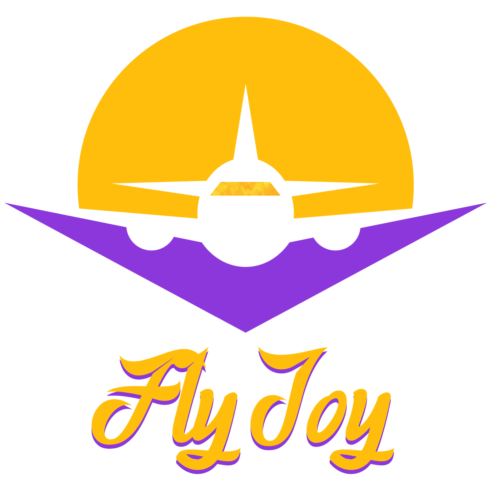
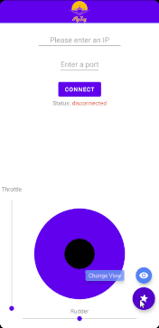

<div align="center">



</div>

## About

This is a project for "Advanced Programming 2" course in Bar-Ilan University. The application can connect to "FlightGear" flight simulator for controlling the aircraft using a joystick and seek bars.<br>
[FlightGear](https://www.flightgear.org/) Flight Simulator is a free, open-source program for Mac, Windows or Linux. It simulates a plane in various modes, such as taking off, flight and landing. It includes features such as viewing the plane from different angles, changing the time of the day or the location.

## Preview



## Key Features

- #### Connecting to FlightGear:
  - The app is able to connect to the FlightGear telnet server and send to it commands.
- #### Controlling the Aircraft:
  - You have the ability to use a joystick to control the aileron and elevator and two seek bars for the throttle and rudder controls.
- #### Extras:
  You can use the Extras (⭐) button located at the bottom which features:
  - <b>Change View -</b> change the view of the plane from first person to third person.
  - <b>Set Morning & Evening -</b> change the time of day inside the simulator to day or evening if you're feeling a bit tired 😴.
  - <b>Start Engine -</b> There is a feature inside FlightGear to autostart the aircraft (this is a simulator so it also simulates the process of starting the engine, it is very difficult start the engine so that's why this feature exists) so you can start flying away.
  - <b>Developer Mode -</b> FlightGear is very customizable through the telnet server, you can change almost every aspect of it, since there are many more things you can change live, and for developing purpose (and fun) this dev console can be very handy and fun 👨🏻‍💻.

## Project Files

The project files include the following:

- The <b>views</b> folder includes the view in the project: MainActivity which includes both XML in "app/src/main/res/layout" folder (which handles the UI elements placements, etc) and the kotlin file inside views folder.
- The <b>view-model</b> folder includes the ViewModel class which is responsible for presentation logic.
- The <b>model</b> folder includes the class which is part of the program's model.
- The <b>drawable</b> folder located at "app/src/main/res" contains images used in the project.

#### Additional details on each class can be found [here](docs/classesInfo.md).

## Dependencies

- Either the latest [FlightGear Simulator](https://www.flightgear.org/download/) or any older version from 2018.3.1 and above.
- Android device running on Oreo and above, or can use an android studio emulator.

#### Libraries used:

- [Vertical SeekBar](https://github.com/h6ah4i/android-verticalseekbar) v1.0.0
- [Virtual Joystick Android](https://github.com/controlwear/virtual-joystick-android) v1.10.1
- [ExpandableFab](https://github.com/nambicompany/expandable-fab) v1.0.2

## Installation

Get the apk from the release tab on the side.

## Running & Usage on Android Studio

Clone the project using:

```
git clone https://github.com/eyalmichon/FlyJoy.git
```

Open Android Studio. Go to File -> New -> Import Project. Then choose the specific project you want to import and then click Next->Finish. It will build the Gradle automatically and'll be ready for you to use.

## Additional information

- [More documentation and project UML](docs/classesInfo.md)
- [Project's video]()
