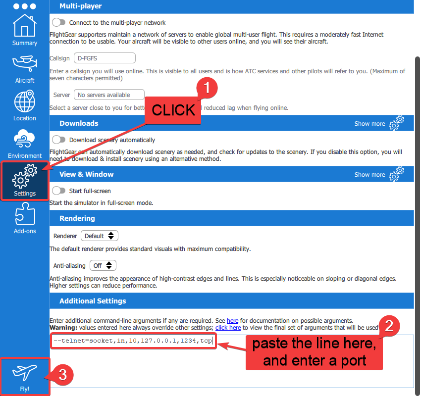

## Additional Documentation

The project implements the MVVM design pattern, being seperated to 3 major parts - The views, which are responsible for presenting the visual part of the app, the ViewModel, which is responsible for the presentation logic required for the view, and the model which is responsible for the program's logic and data.

#### The View

- <b>MainActivity</b> - the main window of the program, which contains the user-controls responsible for presenting the different available functions of the application. The MainActivity class creates the ViewModel neccesary for for the view at its initialization. It allows us interacting with a model which will be in charge of communication with the server.

#### The ViewModel

- <b>ViewModel</b> - a general ViewModel class, Contains an instance of the model and other data binding elements.

#### The Model

- The <b>Model</b> is in charge of connecting to FlightGear through a TCP Socket and being able to send the data needed to FlightGear. It is also in charge of the data binded isConnected which makes sure the view is aware of the connection status so it can change its appearance in relation to the connection.
  Other elements which are saved in the Model are the throttle, rudder, aileron, and elevator.

#### The Data Flow

1. User opens the app via android phone or the android emulator.
2. Launch FlightGear simulator on your PC with the following settings:

```
--telnet=socket,in,10,127.0.0.1,[CHOOSE A PORT],tcp
```

 

3. Wait for Flight Gear to load, this might take some time depending on your PC. 
4. Make sure your phone/emulator and PC are connected to the same network and enter in the app the IP of the PC that's running the FlightGear game, and the port you have chosen at part 2. 
5. If the connection was successful you'll get a green connected status, otherwise you'll get an error depending on the problem. 
6. You can now control the aircraft with the app. 
7. Pro-Tip: You can press the (⭐) button to change the time of day, and also autostart the aircraft, if you're really into playing around with FlightGear you can activate the Developer Mode which will enable you to send any command that you'd like to the FlightGear server. (For easy command viewing you can press '/' inside flight gear and see each and every property of the game changing in real time + you'll be able to change it there and also inside the app 😃)

### UML Chart


